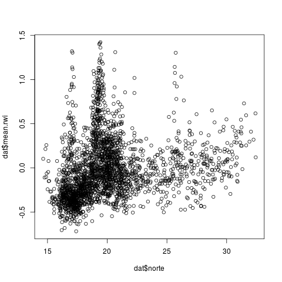
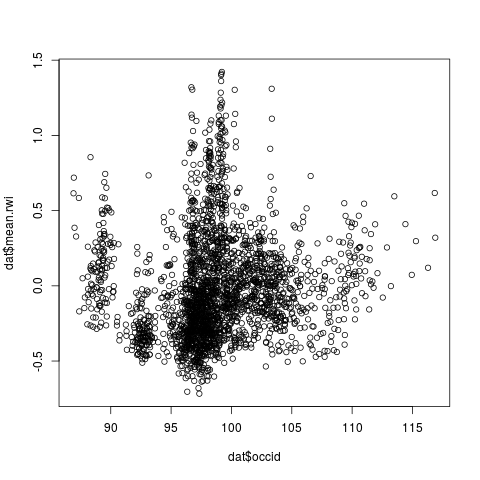
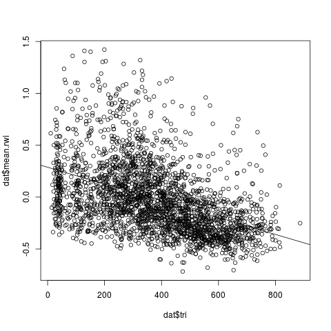

# Table of Contents

1.  [Variables en los archivos `phys-mu.csv` (nivel municipio) y `phys-se.csv` (nivel sección)](#org4b5a7cd)
2.  [Variables en los archivos `censo2020-mu.csv` (nivel municipio) y `censo2020-se.csv` (nivel sección)](#orga2f92d4)

**Trabajo final de PC3**

En la carpeta `data/` encontrarán indicadores del censo 2020 así como estadísticos de información georreferenciada. Hay datos a nivel municipio y a nivel de sección electoral. 

Su trabajo consiste en explorar algunos de estos indicadores en busca de patrones interesantes. Reportarán sus hallazgos en una presentación el día que nos asigne dirección escolar para el examen final.

Por ejemplo, en `R` (puede usar `stata` o `excel`) lea los datos municipales

    > ce.mu <- read.csv("censo2020-mu.csv")
    > ph.mu <- read.csv("phys-mu.csv")

explore su contenido

    > str(ce.mu)
    > str(ph.mu)

y consolide los datos

    > dat <- merge(x = ph.mu, y = ce.mu, by = "inegi", all = TRUE)

Suponga que quiere explorar la relación entre la medición de pobreza de Facebook y la latitud/longitud. Recodifiquemos las variables para interpetarlas como ubicación más al norte o más occidental

    > dat$norte <- dat$lat
    > dat$occid <- -dat$lon

    > plot(dat$norte,  dat$mean.rwi)
    > plot(dat$occid,  dat$mean.rwi)

Los diagramas sugieren asociación, aunque con ruido. Habrá que ver cómo cambia con más controles. Un posible control es la geografía accidentada

    > plot(dat$tri, dat$mean.rwi)
    > abline(lm(dat$mean.rwi ~ dat$tri))

También puede mirarse el coeficiente de correlación

    > cor.test(dat$mean.rwi, dat$tri, method = "pearson", use = "complete.obs")
    
            Pearson's product-moment correlation
    
    data:  dat$mean.rwi and dat$tri
    t = -24.371, df = 2455, p-value < 2.2e-16
    alternative hypothesis: true correlation is not equal to 0
    95 percent confidence interval:
     -0.4726625 -0.4089614
    sample estimates:
           cor 
    -0.4413679 

que es estadísticamente distinta de cero. O incluso especificar un modelo multivariado

    > reg <- lm(dat$mean.rwi ~ dat$tri + dat$norte + dat$occid)
    > summary(reg)
    Residuals:
         Min       1Q   Median       3Q      Max 
    -0.60999 -0.20996 -0.05567  0.13657  1.30794 
    
    Coefficients:
                  Estimate Std. Error t value Pr(>|t|)    
    (Intercept) -7.215e-01  1.623e-01  -4.446 9.15e-06 ***
    dat$tri     -8.402e-04  3.744e-05 -22.438  < 2e-16 ***
    dat$norte   -2.921e-03  2.819e-03  -1.036      0.3    
    dat$occid    1.093e-02  2.042e-03   5.353 9.45e-08 ***
    ---
    Signif. codes:  0 ‘***’ 0.001 ‘**’ 0.01 ‘*’ 0.05 ‘.’ 0.1 ‘ ’ 1
    
    Residual standard error: 0.3082 on 2453 degrees of freedom
      (13 observations deleted due to missingness)
    Multiple R-squared:  0.2093,	Adjusted R-squared:  0.2083 
    F-statistic: 216.4 on 3 and 2453 DF,  p-value: < 2.2e-16

Nótese el coeficiente del norte que, controlando por occidente y por terreno accidentado, pierde significancia estadística. Quizás haya interacciones por descubrir. 

# Variables en los archivos `phys-mu.csv` (nivel municipio) y `phys-se.csv` (nivel sección)

-   `edon` = número de estado.
-   `edo` = estado (abreviatura que preserva el orden alfabético).
-   `ife` = número de municipio usado por el IFE/INE.
-   `inegi` = número de municipio usado por el INEGI.
-   `mun` = nombre del municipio.
-   `tri` = topography ruggedness index from <https://diegopuga.org/data/rugged/#country>. In the source, the map is broken into a regularly-spaced 30 arc-seconds grid of cells (each covering about 1km2); the index for each cell is the sum of absolute altitude differences in meters to the eight adjacent cells (N, NE, E, SE, S, SW, W, and NW). Here `tri` reports the mean value of cells inside the unit's borders weighted by cell area to account for latitude.
-   `lon`, `lat` = longitud y latitud del centro geométrico (centroide) de la unidad.
-   `di.urb` = distancia en kms al polígono urbano más próximo.
-   `di.ffcc` = distancia en kms a la vía férrea más próxima.
-   `di.road` = distancia en kms a la carretera más próxima.
-   `di.pyram` = distancia en kms a la pirámide prehispánica más próxima.
-   `mean.alt`, `med.alt`, `sd.alt`  = the unit's altitude in metres, from <https://eros.usgs.gov/>. As for \(tri\), source provides 30 arc-seconds grid with altitude. I report the mean, median, and standard deviation of cells inside the unit's borders.
-   `mean.rwi`, `med.rwi`, `sd.rwi` = Facebook's Relative Wealth Index, from <https://dataforgood.facebook.com/dfg/tools/relative-wealth-index> (data updated 8 April 2021). Household surveys-trained machine learning algorithms applied to discover relative welfare patterns in satellite images, topographic maps, mobile phone and Facebook networks. Source distributes micro-estimates of wealth and poverty covering the populated surface at 2.4km resolution. I report the mean, median, and standard deviation of cells inside the unit's borders (with missing data for units containing no tile in the source.)
-   `area` = área de la unidad en km2.

# Variables en los archivos `censo2020-mu.csv` (nivel municipio) y `censo2020-se.csv` (nivel sección)

-   `edon` = número de estado.
-   `ife` = número de municipio usado por el IFE/INE.
-   `seccion` = número de sección electoral del estado.
-   `POBTOT` = Personas, nacionales o extranjeras que residen habitualmente en el ámbito geográfico de referencia correspondiente.
-   `POBFEM` = Mujeres, nacionales o extranjeras que residen habitualmente en el ámbito geográfico de referencia correspondiente.
-   `P_3YMAS` = Personas de 3 a 130 años de edad.
-   `P_5YMAS` = Personas de 5 a 130 años de edad.
-   `P_12YMAS` = Personas de 12 a 130 años de edad.
-   `P_15YMAS` = Personas de 15 a 130 años de edad.
-   `P_18YMAS` = Personas de 18 a 130 años de edad.
-   `PROM_HNV` = Resultado de dividir el total de hijas e hijos nacidos vivos de las mujeres de 12 a 130 años de edad, entre el total de mujeres del mismo grupo de edad. Excluye a las mujeres que no especificaron el número de hijas e hijos nacidos vivos y a las que sí han tenido, pero no especificaron el total de ellos.
-   `PNACENT` = Personas nacidas en la misma entidad federativa.
-   `P3YM_HLI` = Personas de 3 a 130 años de edad que hablan alguna lengua indígena.
-   `P5_HLI` = Personas de 5 a 130 años de edad que hablan alguna lengua indígena.
-   `PHOG_IND` = Total de personas que forman hogares censales donde la persona de referencia del hogar o su cónyuge o alguno de los ascendientes de estos, declararon hablar lengua indígena.
-   `POB_AFRO` = Personas que se consideran afromexicanos o afrodescendientes.
-   `P6A11_NOA` = Personas de 6 a 11 años de edad que no van a la escuela.
-   `P12A14NOA` = Personas de 12 a 14 años de edad que no van a la escuela.
-   `P12A14NOAF` = Mujeres de 12 a 14 años de edad que no van a la escuela.
-   `P8A14AN` = Personas de 8 a 14 años de edad que no saben leer y escribir un recado.
-   `P15YM_AN` = Personas de 15 a 130 años de edad que no saben leer y escribir un recado.
-   `P15YM_SE` = Personas de 15 a 130 años de edad que no aprobaron ningún grado escolar o que sólo tienen nivel preescolar.
-   `P15PRI_IN` = Personas de 15 a 130 años de edad que tienen como máxima escolaridad hasta el quinto grado aprobado en primaria. Incluye a las personas que no especificaron los grados aprobados en el nivel señalado.
-   `P15PRI_CO` = Personas de 15 a 130 años de edad que tienen como máxima escolaridad 6 grados aprobados en primaria.
-   `P15SEC_CO` = Personas de 15 a 130 años de edad que tienen como máxima escolaridad 3 grados aprobados en secundaria.
-   `GRAPROES` = Resultado de dividir el monto de grados escolares aprobados por las personas de 15 a 130 años de edad entre las personas del mismo grupo de edad. Excluye a las personas que no especificaron los grados aprobados.
-   `GRAPROES_F` = Resultado de dividir el monto de grados escolares aprobados por las mujeres de 15 a 130 años de edad entre las mujeres del mismo grupo de edad. Excluye a las mujeres que no especificaron los grados aprobados.
-   `PEA` = Personas de 12 a 130 años de edad que trabajaron, tenían trabajo pero no trabajaron o buscaron trabajo en la semana de referencia.
-   `POCUPADA` = Personas de 12 a 130 años de edad que trabajaron o que no trabajaron, pero sí tenían trabajo en la semana de referencia.
-   `PSINDER` = Total de personas que no están afiliadas a servicios médicos en ninguna institución pública o privada
-   `PDER_SS` = Total de personas que están afiliadas a servicios médicos en alguna institución de salud pública o privada como: el Instituto Mexicano del Seguro Social (IMSS), el Instituto de Seguridad y Servicios Sociales de los Trabajadores del Estado (ISSSTE e ISSSTE estatal), Petróleos Mexicanos (PEMEX), la Secretaría de la Defensa Nacional (SEDENA), la Secretaría de Marina Armada de México (SEMAR), el Instituto de Salud para el Bienestar (INSABI) o en otra.
-   `PDER_IMSS` = Total de personas que están afiliadas a servicios médicos en el Instituto Mexicano del Seguro Social (IMSS).
-   `PDER_ISTE` = Total de personas que están afiliadas a servicios médicos en el Instituto de Seguridad y Servicios Sociales de los Trabajadores del Estado.
-   `PDER_ISTEE` = Total de personas que están afiliadas a servicios médicos en los institutos de seguridad social de los estados (ISSSTE, ISSSEMyM, ISSSTEZAC, ISSSPEA o ISSSTESON).
-   `PAFIL_PDOM` = Total de personas que están afiliadas a servicios médicos en Petróleos Mexicanos (PEMEX), la Secretaría de la Defensa Nacional (SEDENA) o la Secretaría de Marina Armada de México (SEMAR).
-   `PDER_SEGP` = Total de personas que están afiliadas a servicios médicos en la Secretaría de Salud, mediante en el Instituto de Salud para el Bienestar.
-   `PDER_IMSSB` = Total de personas que están afiliadas a servicios médicos en el Instituto Mexicano del Seguro Social (IMSS) BIENESTAR
-   `PAFIL_IPRI` = Total de personas que están afiliadas a servicios médicos en instituciones de salud privadas.
-   `PAFIL_OTRA` = Total de personas que están afiliadas a servicios médicos en cualquier otra institución de salud pública o privada.
-   `TOTHOG` = Hogares en viviendas particulares habitadas. Se considera un hogar en cada vivienda particular. Incluye casa única en el terreno; casa que comparte terreno con otra(s); casa dúplex; departamento en edificio; vivienda en vecindad o cuartería; vivienda en cuarto de azotea de un edificio; local no construido para habitación; vivienda móvil; refugio y no especificado de vivienda particular.
-   `POBHOG` = Personas en hogares censales. Se considera un hogar en cada vivienda particular. Incluye casa única en el terreno; casa que comparte terreno con otra(s); casa dúplex; departamento en edificio; vivienda en vecindad o cuartería; vivienda en cuarto de azotea; local no construido para habitación; vivienda móvil; refugio y no especificado de vivienda particular.
-   `VIVPAR_HAB` = Viviendas particulares habitadas de cualquier clase: casa única en el terreno; casa que comparte terreno con otra(s); casa dúplex; departamento en edificio; vivienda en vecindad o cuartería; vivienda en cuarto de azotea de un edificio; local no construido para habitación, vivienda móvil; refugio y no especificado de vivienda particular. Excluye a las viviendas particulares sin información de ocupantes.
-   `OCUPVIVPAR` = Personas que residen en viviendas particulares habitadas de cualquier clase: casa única en el terreno; casa que comparte terreno con otra(s); casa dúplex; departamento en edificio; vivienda en vecindad o cuartería; vivienda en cuarto de azotea de un edificio; local no construido para habitación, vivienda móvil; refugio y no especificado de vivienda particular. Incluye una estimación de personas en viviendas particulares sin información de ocupantes y menores omitidos.
-   `PROM_OCUP` = Resultado de dividir el número de personas que residen en viviendas particulares habitadas, entre el número de esas viviendas.
-   `PRO_OCUP_C` = Resultado de dividir el número de personas que residen en viviendas particulares habitadas entre el número de cuartos de esas viviendas. Comprende las viviendas particulares para las que se captaron las características de la vivienda, clasificadas como: casa única en el terreno; casa que comparte terreno con otra(s); casa dúplex; departamento en edificio; vivienda en vecindad o cuartería; vivienda en cuarto de azotea de un edificio y no especificado de vivienda particular. Incluye a las viviendas particulares sin información de ocupantes.
-   `VPH_PISOTI` = Viviendas particulares habitadas con piso de tierra. Comprende las viviendas particulares para las que se captaron las características de la vivienda, clasificadas como: casa única en el terreno; casa que comparte terreno con otra(s); casa dúplex; departamento en edificio; vivienda en vecindad o cuartería; vivienda en cuarto de azotea de un edificio y no especificado de vivienda particular. Incluye a las viviendas particulares sin información de ocupantes.
-   `VPH_2YMASD` = Viviendas particulares habitadas que usan para dormir entre 2 y 25 cuartos. Comprende las viviendas particulares para las que se captaron las características de la vivienda, clasificadas como: casa única en el terreno; casa que comparte terreno con otra(s); casa dúplex; departamento en edificio; vivienda en vecindad o cuartería; vivienda en cuarto de azotea de un edificio y no especificado de vivienda particular. Incluye a las viviendas particulares sin información de ocupantes.
-   `VPH_S_ELEC` =Viviendas particulares habitadas que no tienen energía eléctrica. Comprende las viviendas particulares para las que se captaron las características de la vivienda, clasificadas como: casa única en el terreno; casa que comparte terreno con otra(s); casa dúplex; departamento en edificio; vivienda en vecindad o cuartería; vivienda en cuarto de azotea de un edificio y no especificado de vivienda particular. Incluye a las viviendas particulares sin información de ocupantes.
-   `VPH_AGUADV` = Viviendas particulares habitadas que tienen disponibilidad de agua entubada dentro de la vivienda o sólo en el patio o terreno. Comprende las viviendas particulares para las que se captaron las características de la vivienda, clasificadas como: casa única en el terreno; casa que comparte terreno con otra(s); casa dúplex; departamento en edificio; vivienda en vecindad o cuartería; vivienda en cuarto de azotea de un edificio y no especificado de vivienda particular. Incluye a las viviendas particulares sin información de ocupantes.
-   `VPH_AEASP` = Viviendas particulares habitadas que tienen agua entubada y se abastecen del servicio público de agua. Comprende las viviendas particulares para las que se captaron las características de la vivienda, clasificadas como: casa única en el terreno; casa que comparte terreno con otra(s); casa dúplex; departamento en edificio; vivienda en vecindad o cuartería; vivienda en cuarto de azotea de un edificio y no especificado de vivienda particular. Incluye a las viviendas particulares sin información de ocupantes.
-   `VPH_AGUAFV` = Viviendas particulares habitadas que no tienen disponibilidad de agua entubada. Comprende las viviendas particulares para las que se captaron las características de la vivienda, clasificadas como: casa única en el terreno; casa que comparte terreno con otra(s); casa dúplex; departamento en edificio; vivienda en vecindad o cuartería; vivienda en cuarto de azotea de un edificio y no especificado de vivienda particular. Incluye a las viviendas particulares sin información de ocupantes.
-   `VPH_EXCSA` = Viviendas particulares habitadas que tienen taza de baño (excusado o sanitario). Comprende las viviendas particulares para las que se captaron las características de la vivienda, clasificadas como: casa única en el terreno; casa que comparte terreno con otra(s); casa dúplex; departamento en edificio; vivienda en vecindad o cuartería; vivienda en cuarto de azotea de un edificio y no especificado de vivienda particular. Incluye a las viviendas particulares sin información de ocupantes.
-   `VPH_C_SERV` = Viviendas particulares habitadas que tienen energía eléctrica, agua entubada dentro de la vivienda o sólo en el patio o terreno y drenaje conectado a la red pública; una fosa séptica o tanque séptico (biodigestor); una tubería que va a dar a una barranca o grieta, río, lago o mar. Comprende las viviendas particulares para las que se captaron las características de la vivienda, clasificadas como: casa única en el terreno; casa que comparte terreno con otra(s); casa dúplex; departamento en edificio; vivienda en vecindad o cuartería; vivienda en cuarto de azotea de un edificio y no especificado de vivienda particular. Incluye a las viviendas particulares sin información de ocupantes.
-   `VPH_NDEAED` = Viviendas particulares habitadas que no tienen energía eléctrica, agua entubada ni drenaje. Comprende las viviendas particulares para las que se captaron las características de la vivienda, clasificadas como: casa única en el terreno; casa que comparte terreno con otra(s); casa dúplex; departamento en edificio; vivienda en vecindad o cuartería; vivienda en cuarto de azotea de un edificio y no especificado de vivienda particular. Incluye a las viviendas particulares sin información de ocupantes.
-   `VPH_REFRI` = Viviendas particulares habitadas que tienen refrigerador. Comprende las viviendas particulares para las que se captaron las características de la vivienda, clasificadas como: casa única en el terreno; casa que comparte terreno con otra(s); casa dúplex; departamento en edificio; vivienda en vecindad o cuartería; vivienda en cuarto de azotea de un edificio y no especificado de vivienda particular. Incluye a las viviendas particulares sin información de ocupantes.
-   `p1def2020` = promedio anual 2010-2019 de defunciones infantiles (menores de 1 año de edad).

